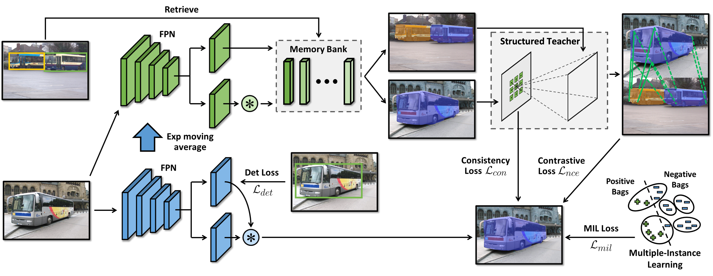

## DiscoBox: Weakly Supervised Instance Segmentation and Semantic Correspondence from Box Supervision

<div align="center">
  
</div>

The PyTorch implementation of DiscoBox: Weakly Supervised Instance Segmentation and Semantic Correspondence from Box Supervision.


```BibTeX
@article{lan2021discobox,
  title={DiscoBox: Weakly Supervised Instance Segmentation and Semantic Correspondence from Box Supervision},
  author={Lan, Shiyi and Yu, Zhiding and Choy, Christopher and Radhakrishnan, Subhashree and Liu, Guilin and Zhu, Yuke and Davis, Larry S and Anandkumar, Anima},
  journal={arXiv preprint arXiv:2105.06464},
  year={2021}
}
```

[ [`Paper`](https://arxiv.org/abs/2105.06464) ] 

## Introduction

This repository is the implementation of evaluating DiscoBox on PF-Pascal dataset.

This implementation is based on [SCOT](https://github.com/csyanbin/SCOT)


## Installation

### Conda environment settings

    conda create -n scot python=3.6
    conda activate scot

    cat /usr/local/cuda/version.txt
    conda install pytorch=1.4.0 torchvision cudatoolkit=10.0 -c pytorch (if CUDA 10) 
    conda install pytorch=1.4.0 torchvision cudatoolkit=9.0 -c pytorch (if CUDA 9) 
    
    conda install -c anaconda scikit-image
    conda install -c anaconda pandas
    conda install -c anaconda requests
    pip install gluoncv-torch
    
## Pretrained Weights

Download the pretrained weights from [this link](https://drive.google.com/drive/u/6/folders/1LCWVpGvDOwgNcAJowsLBJ9E656iT0aVv).

### Evaluation

Results on PF-PASCAL with res101:

```
    python evaluate_map_CAM.py --dataset pfpascal --thres img --backbone resnet101 --hyperpixel '(2,22,24,25,27,28,29)' --sim OTGeo --exp1 1.0 --exp2 0.5 --eps 0.05 --gpu 0 --classmap 1 --split test --alpha 0.05
    python evaluate_map_CAM.py --dataset pfpascal --thres img --backbone resnet101 --hyperpixel '(2,22,24,25,27,28,29)' --sim OTGeo --exp1 1.0 --exp2 0.5 --eps 0.05 --gpu 0 --classmap 1 --split test --alpha 0.10
    python evaluate_map_CAM.py --dataset pfpascal --thres img --backbone resnet101 --hyperpixel '(2,22,24,25,27,28,29)' --sim OTGeo --exp1 1.0 --exp2 0.5 --eps 0.05 --gpu 0 --classmap 1 --split test --alpha 0.15
```

#### All results


|  Method  |  Backbone  | PCK@0.05 | PCK@0.1 | PCK@0.15 |
|:--------:|:----------:|:--------:|:-------:|:--------:|
|   [SCOT](https://github.com/csyanbin/SCOT)   | ResNet-101 |     63.2   |    85.4   |      92.8    |\
| DiscoBox | ResNet-101 |   62.7     |    85.6   |     93.5    |


